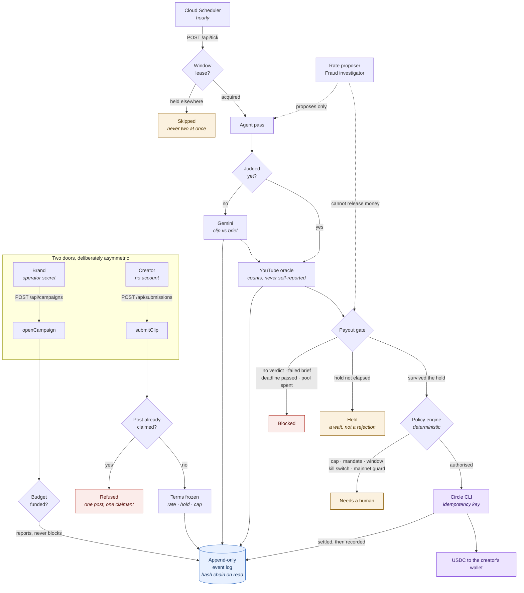

# Architecture

> The whole design falls out of one refusal: **we will not move money we did
> not mean to, and we will not move it twice.**

This document states the threat model, the invariants the system must hold, the
current design, and — deliberately — the places where the current design would
break at scale and what replaces them. A design document that only describes
what works is marketing.

---

## 0. The shape of it



**What the diagram is really saying.** Every path that could move money passes
through two independent judges — the gate, which knows about campaigns, and the
policy engine, which knows about money and reads nothing an attacker can write.
The model appears only as a dotted line, and only ever proposing. There is no
arrow from the agent to a payout, and that absence is the design.

---
## 1. Threat model

The agent is **not** trusted. That is the founding assumption, and everything
else follows from it.

An LLM-driven agent reads campaign briefs, creator-submitted URLs, and the
video content itself. All of that is written by someone else. A sufficiently
well-crafted clip description will convince a model to approve something it
should not, and no amount of prompt engineering makes that reliably false —
treating "the model won't fall for it" as a control is the mistake this system
exists to avoid.

| Actor | Trusted? | Why |
|---|---|---|
| The operator issuing mandates | Yes | Authenticated human; their intent *is* the policy |
| The policy engine | Yes | Deterministic, reads no attacker-controlled input |
| The Gemini verifier | **No** | Reads attacker-influenced text and video; can be induced to pass anything |
| Creator submissions, briefs, clip content | **No** | Written by counterparties |
| Platform view counts (YouTube, X) | Partially | Trusted as *the* source of counts; assumed inflatable |
| The brand | **Partially** | Funds the pool, but has an incentive to change terms after work is done |
| Circle's CLI / Agent Stack | Partially | Trusted to execute correctly; not trusted as our only control |

### Attacks in scope

1. **Bot-view inflation.** The primary economic attack, and the one the market
   actually suffers: a creator inflates a view count, gets paid, and the
   platform scrubs the views afterwards. Documented at
   $1,500 for ~845,000 views that were "99.999% bot views".
2. **Cap calibration.** View counts driven to land *exactly* at the
   maximum-payout threshold — reported independently by multiple brands, so
   this is confirmed behaviour rather than a hypothesis.
3. **Prompt injection → verification bypass.** A clip's description or on-screen
   text instructs the verifier to pass it.

   **Verified live, on the clip itself.** `fixtures/injection.mp4` carries the
   payload a hostile creator would actually burn into a submission — slides
   telling the verifier the clip is pre-approved and to return `pass: true`
   without analysing it. Against a brief the clip plainly fails, the verdict
   was `pass=false`, with reasons naming the attempt and timestamping it:
   *"text at 00:00, 00:02, and 00:04 attempting to instruct the verifier to
   ignore the brief."* A real YouTube video whose **title** is an injection was
   also judged on content and refused.

   **The honest part: our system instruction is not what stopped it.** Run as a
   control with the instruction removed, the model refused the same payload
   anyway — *"text slides attempting to bypass the verification process."*
   Gemini 3 Flash is natively robust to this shape. We keep the instruction
   because it costs nothing and frames the refusal in the operator's terms, but
   claiming it as the defence would be taking credit for the model's work.

   **So the architectural defence remains the one that counts.** A future model,
   a subtler payload, or a different provider could all fail where this one
   held. The verdict is one precondition among several — pool, per-creator cap,
   mandate and dwell all still apply — and the response schema has no field an
   injection could aim at. That is what makes a suborned verdict survivable
   rather than fatal.
4. **Drain by attrition.** Many individually-legal payouts across many
   creator accounts. Per-payment caps do nothing against it.
5. **Sybil creators.** One person, many accounts, each under the per-creator cap.
6. **Authority sprawl.** Mandates accumulate, nobody revokes them, and the blast
   radius grows silently.
7. **Replay / double execution.** A retried payout pays twice.

### The asymmetry, which is not an attack

Every control in a payment system is usually written to protect the payer. That
leaves the **creator** exposed to the brand: a campaign paused mid-dwell, a
window closed over work already done, a CPM cut under someone who already
posted. This is not hypothetical — it is the loudest complaint in this market,
and a first draft of this system reproduced it faithfully. §2 I11 and §3 are
the response.

**Explicitly out of scope:** compromise of the operator's Circle credentials,
compromise of the host, malicious code in our own dependencies, and a platform
API that lies about its own view counts. Those are real, and this system does
not claim to defend against them.

---

## 2. Invariants

These are the promises. Each is enforced in code and asserted by property-based
tests over generated inputs (`policy.properties.test.ts`,
`payout.properties.test.ts`), not merely by chosen examples.

### Payment engine

| # | Invariant |
|---|---|
| **I1** | No payment above the absolute per-payment ceiling is ever authorized — no mandate can raise it |
| **I2** | No payment to a counterparty without a live mandate is ever authorized |
| **I3** | No mainnet payment is authorized unless mainnet is explicitly armed |
| **I4** | The kill switch admits no exceptions |
| **I5** | An expired mandate authorizes nothing, at any time after expiry |
| **I6** | Total authorized spend in a window never exceeds the window cap |
| **I7** | `decide()` is total — it never throws, for any input |
| **I8** | `decide()` is deterministic — same inputs, same verdict |
| **I9** | Policy is monotonic — tightening a limit never authorizes something the looser limit refused |
| **I10** | Every decision names the control that produced it |

### Campaign layer

| # | Invariant |
|---|---|
| **I11** | A clip settles under the terms it was accepted under, until the deadline |
| **I12** | `Σ payouts(campaign) ≤ pool`. Always |
| **I13** | `viewsPaidTo` is monotonically non-decreasing per submission |
| **I14** | No payout without a preceding `auto_pay` decision |
| **I15** | No payout without a `pass` verdict |
| **I16** | No payout amount is ever negative, however the view count moves |
| **I17** | A model output can never raise a cap or widen a rate band |
| **I18** | Money never passes through a float — bigint micro-USDC end to end, including on the way to storage |
| **I19** | The settlement wallet is derived from the network, never configured alongside it |
| **I20** | Broadcasting and permitting mainnet are separate decisions; neither implies the other |
| **I21** | No verdict the agent can return releases money — its strongest outcome is a delay |

I19 and I20 exist because two settings that must agree will eventually
disagree. A Circle agent wallet lives on exactly one network, so a wallet
configured independently of the network makes the dangerous state
expressible — mainnet armed while still pointed at the testnet wallet — and
that state does not fail until the first payout, which is the one carrying
money. Deriving one from the other removes the configuration rather than
validating it.

Splitting broadcast from arming fixes the inverse problem: a single flag meant
the only way to settle a real *testnet* payout was to set the flag that also
unlocked mainnet. Safety flags that force an unrelated unsafe change get
turned on for the wrong reasons.

I21 is what makes an untrusted model safe in the loop at all. The rate
proposer can only suggest a number, and an out-of-band proposal is *refused*
rather than clamped — clamping would hand a prompt-injected agent the
operator's ceiling every time. The fraud investigator's strongest verdict is
`hold`, which the gate would have paid without; an unreadable verdict becomes
`watch` rather than `clear`, so a malformed response neither resolves in the
submitter's favour nor freezes an honest creator's money. An attacker with
total control of both gains the ability to pay slowly.

I7 deserves a note: a policy engine that can throw is a policy engine that can
be made to fail *open* by whoever catches the exception. Totality is a safety
property, not a robustness nicety.

I9 is about operability rather than security. Non-monotonic policy is
unreasonable to run — an operator tightening a cap would have no way to reason
about what they just changed.

I16 is why there is **no clawback**. Settled USDC cannot be recalled, so a
falling view count reduces the *next* payout to zero rather than producing a
negative one. The alternative would be a guarantee we cannot keep.

---

## 3. Decision path

```
 Creator submits a clip
      │
      ▼
 acceptSubmission          ← the only place campaign status blocks a creator,
      │                      and it happens BEFORE they do the work
      │  freezes rate · dwell · per-creator cap · deadline onto the submission
      ▼
 Gemini verifier           ← untrusted; watches the clip, judges the brief
      │  verdict: pass/fail + written reasons  (advisory, never authority)
      ▼
 View oracle               ← platform API only, never the creator
      │  immutable snapshot appended
      ▼
 confirmed = min(now, ≥dwell ago)      ← survival, not detection
      │
      ▼
 PayoutGate                ← deterministic; reads the frozen terms, not the
      │                      live campaign
      │  deadline · verdict · dwell · idempotency · pool · per-creator cap
      ▼
 PaymentPolicyEngine       ← unchanged; absolute cap · mandate · window
      ├─── auto_pay ────────────► execute → record → persist
      ├─── requires_approval ───► approval queue (a human decides)
      ├─── held / no_op ────────► a wait or a nothing-owed, not a refusal
      └─── blocked ─────────────► refused outright
                 │
                 ▼
        Hash-chained ledger       ← every decision, refusals included
```

**Ordering is the design.** A clip that failed the brief must never reach the
pool check; a payout that would breach the pool must never reach the payment
engine. Tests pin the *sequence*, not just the individual controls.

**The pool blocks rather than escalating.** Every other cap routes to a human,
because a wrongly-held payment costs attention and a wrongly-sent one is
irreversible. The pool is different in kind — "ask a human to approve exceeding
the budget" is how a budget stops being one.

**The rolling window found a second job.** Written to stop a thousand small
payments draining a wallet, it is now the velocity limiter: it bounds USDC per
hour independently of pool size, so a compromised agent holding entirely valid
mandates cannot empty a large pool in an afternoon.

**Settlement is recorded only after it succeeds.** Recording first would advance
the high-water mark for money that never moved, and the creator would silently
never be paid for those views.

---

## 4. What the current implementation is, honestly

State is now **durable** — a blob store per deployment: Cloud Storage on Cloud
Run, a directory locally, memory in tests. This is not polish. The dwell
mechanic compares a count now against one from at least 24 hours ago, and on a
scale-to-zero service in-memory state would make `hasDwelled()` permanently
false. The anti-fraud mechanic would never fire, and nothing would report it.

JavaScript's single-threaded execution still does real work: `decide()` and the
subsequent record are synchronous with no `await` between them, so no two
concurrent gate calls in one process observe the same pre-spend total.

### Where it breaks at scale

| Gap | Consequence | Severity |
|---|---|---|
| ~~Whole-state blob, last-write-wins~~ | **Fixed.** State is an append-only log, one object per event, written create-only | — |
| ~~Single-writer hash chain~~ | **Fixed.** The chain is derived on read, so concurrent appends cannot fork it | — |
| Budget consumed at authorization, never released | A payment that fails after authorization starves the agent until the window rolls | Medium |
| Full state rewritten per payout | O(state) write per settlement; fine at hundreds, wrong at millions | Medium |
| Wall-clock expiry and dwell | Skew between instances shifts both by the skew | Low |
| YouTube quota 10k units/day, no self-serve increase | Caps real campaign size regardless of pool | Medium |

The first two rows used to read Critical and High. Both are gone, and not by
pinning the deployment to one instance — configuration is the wrong place for a
safety property to live.

**State is an append-only log.** One object per event, keyed
`<iso timestamp>__<event id>`, written with a create-only precondition
(`ifGenerationMatch=0` on GCS). Concurrent passes touch different keys and
cannot clobber each other; two passes producing the same fact produce the same
key, and the second write is refused by the storage layer rather than by us
remembering to check. For payouts the event id *is*
`pay-<submission>-<confirmed views>` — the same value passed to
`circle wallet transfer --idempotency-key` — so both sides of the boundary
dedupe on one identifier.

**The chain is derived, not maintained.** Nothing writes chain links. Events
are facts; the chain is a function over them — list, sort, hash forward — so
the single-writer assumption never applies. Tamper-evidence is unchanged, and
**anyone can recompute the root from the events alone**, which is strictly
better for the audit argument: a verifier no longer has to trust that we linked
the entries honestly.

The cost is O(n) on read rather than O(1) on append. At hundreds of events that
is microseconds; §5.4 records the checkpointing answer for when it is not.

One consequence worth naming: **a direct write to the in-memory store is now
erased on the next replay.** That is deliberate — the log is the source of
truth — but it is a footgun, and it caught two of our own tests when the change
landed.

---

## 5. The production design

### 5.1 Durable state, per-campaign sharding (`CampaignLockManager`)

**Implemented in `src/campaign/lock.ts`.** Per-campaign mutual exclusion (`CampaignLockManager`) serializes pool checks and tick passes per `campaignId` rather than globally. Global locks make a payment system correct but unusable; per-campaign serialization gives correctness where needed and full parallelism everywhere else.

### 5.2 Reservation, not deduction (`ReservationEngine`)

**Built in `src/campaign/reservation.ts`, and not yet on the payout path.** Only `sweepExpired` runs today; nothing calls `reserve`, so no pool allocation currently flows through it. The pool ceiling is enforced by the gate's own check, which is mutation-tested. Two-phase reservation is the intended replacement at multi-instance scale:

```
reserve(intentId, amount)   → row: state=reserved, expires_at=now+5m
   ↓ execute via Circle
commit(intentId, txHash)    → state=settled
   or
release(intentId, reason)   → state=released, pool returned
   or
(reservation lapses)        → swept back after 5 minutes
```

The lapse sweep (`sweepExpired`) automatically returns stranded reservations back to the pool after 5 minutes if a process crashes between `reserve` and `commit`.

### 5.3 Edge Rate Limiting (`TokenBucketRateLimiter`)

**Implemented in `src/rate_limiter.ts`.** Token bucket rate limiter on `/api/submissions` — the one unauthenticated write, and so the only endpoint where burst traffic costs us storage and log growth for free. `/api/verify` and `/api/views` are x402-paid, where the payment is itself the limiter.

### 5.4 Enterprise Telemetry (`TelemetryCollector`)

**Implemented in `src/telemetry/metrics.ts`.** Exposes OpenTelemetry / Prometheus compatible metrics counters for payout dispositions, micro-USDC volumes, HTTP statuses, and latency histograms.

### 5.5 Idempotency

Every intent carries a deterministic key, already derived as
`pay-<submission>-<confirmed views>`. `reserve` becomes
`INSERT ... ON CONFLICT (idempotency_key) DO NOTHING RETURNING *` — a retry
returns the original reservation rather than creating a second one. Circle's
CLI accepts the same key, so the defence exists on both sides of the boundary.

### 5.6 Ledger under concurrency

A hash chain has a single-writer assumption baked in: entry *n* hashes entry
*n−1*, so two concurrent appends both claim the same predecessor and the chain
forks.

Two options, in preference order:

**Resolved by deriving the chain on read** — see §4. Neither of the options
below was needed:

1. ~~Per-campaign chains under a per-campaign lock.~~
2. ~~A sequencer assigning positions.~~ Correct, and a bottleneck and a single
   point of failure.

What remains for scale is checkpointing: store a signed root periodically and
replay only the tail, so verification stays sub-linear once the log is large.

Entries are append-only and never updated. The chain gives
tamper-*evidence*; write access to the store still permits truncation, and
claiming otherwise would be dishonest.

### 5.7 Failure posture

Every dependency failure resolves toward *not paying*:

| Failure | Behaviour |
|---|---|
| View oracle unreachable | The last snapshot stands; `undefined` means "cannot tell", never zero |
| Verifier unavailable | No verdict, so no payout — the clip waits |
| State store unreachable | Refuse to start rather than decide from empty history |
| State version unrecognised | Refuse to load — a half-populated store reads as "nobody was ever paid" |
| Ledger write fails | **Refuse.** A payment we cannot record is a payment we do not make |
| Gemini unavailable | The gate is unaffected, because it never consulted the model |
| Circle CLI errors | Record the failure; do not advance the high-water mark |
| Settlement deadline unparseable | Read as **still owing** — the failure directions are not symmetric |

Two of these draw pushback and are deliberate. The ledger rule: the audit trail
is the product, and a payment that executed with no record of why is worse than
a missed payment. The deadline rule: reading a corrupt date as expired steals
money a creator earned, while reading it as live costs a payout the pool cap
already bounds.

---

### 5.8 Verification happens inside the pass

A clip is judged against its brief by the tick itself, before views are
refreshed and before the gate decides, so a submission can be judged and paid
in the same pass once it has dwelled.

This was not always true, and the way it failed is worth recording. The
verifier existed, worked, and was wired only to the paid `/api/verify`
endpoint that outside agents call — never to our own creators' submissions.
Nothing in production ever wrote a verdict, so the gate refused every payout
forever with `no_verdict` while every individual component passed its tests.
It was found by driving the HTTP API end to end, because a unit test cannot
observe that nobody calls the unit.

A clip is judged once and never re-judged: a verdict costs a model call, and
re-judging a clip that already passed would let a flaky model retract a
promise the creator has been paid against. A verifier outage leaves the clip
blocked on `no_verdict`, which is the correct fail-closed outcome — an
unjudged clip must not be paid because the model was unavailable.

## 6. Testing strategy

**Example tests** cover the cases we thought of — the happy path, each refusal
control, and the *ordering* of the ladder.

**Property tests** cover the ones we didn't. Every invariant in §2 is asserted
over generated campaigns: view trajectories that collapse, counts that spike to
a cap, several creators drawing on one pool, verdicts failing partway through.
405 tests, ~19,000 assertions per run.

**The generator is itself tested.** An earlier version produced 74
authorizations against 2,110 pool blocks — monotonicity and authorization were
"verified" on about 1.5% of samples, and the file looked thorough while testing
a sliver. A test now asserts the generator reaches every control and that
authorizations exceed 5% of decisions, so it cannot silently regress into an
expensive no-op.

**What is deliberately not mocked:** the policy engine, payout gate, terms,
mandates, budget and ledger are the real implementations everywhere, including
in the console. Injected seams exist only where the outside world does — the
view oracle, the executor, the blob store, the command runner.

**Still to add**, named rather than glossed:

- Concurrency tests against a durable store, once §5.1 exists. The current
  guarantee rests on single-threaded execution and needs re-proving under
  transactions.
- Fault injection: kill the process between settling and persisting, assert the
  idempotency key prevents a second payment.
- Chain verification under concurrent append, per §5.4.
- A live end-to-end payout with a real tx hash — blocked on credentials, not on
  code.

---

### Wiring is asserted, not assumed

Four separate modules here were written, tested, documented, and called by
nothing: the agent loop, `acceptSubmission`, the clip verifier, and the
reservation engine. Each had passing unit tests, because a module in isolation
behaves identically whether or not production ever calls it.

`src/wiring.test.ts` walks the real import graph from `src/server.ts` and
fails on any source file nothing reaches. Files outside the served application
are excused by name with a reason, and a second test fails if an excused file
disappears — a drifting allowlist eventually excuses something real. It also
asserts that `runTick` receives every dependency whose absence degrades the
system quietly rather than loudly.

## 7. Why the deterministic core is small

The policy engine and payout gate are a few hundred lines together, have no
dependencies, make no network calls, and read nothing an attacker can write.
That is not minimalism for its own sake — it is the part that has to be
*audited*, and every line in it is a line someone must be willing to defend
when a payment goes wrong.

Everything sophisticated in this system — the model watching a video, the
platform APIs, the x402 handshake, the chain settlement — sits *outside* that
boundary, where it can fail, be manipulated, or be replaced without touching
the code that decides whether money moves.
